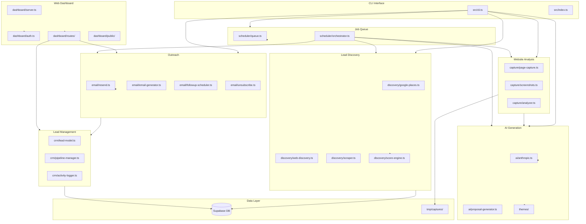
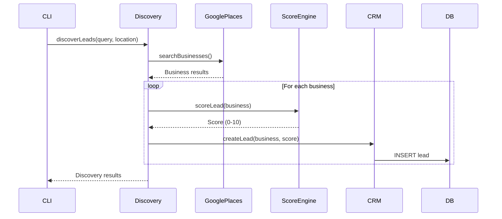
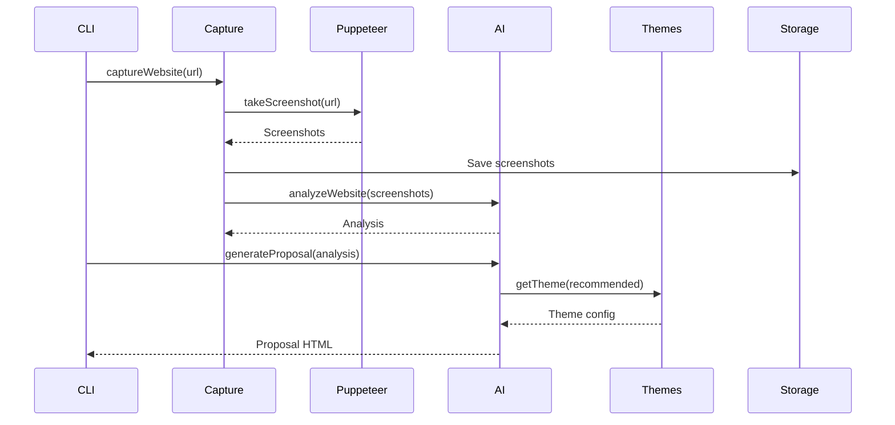
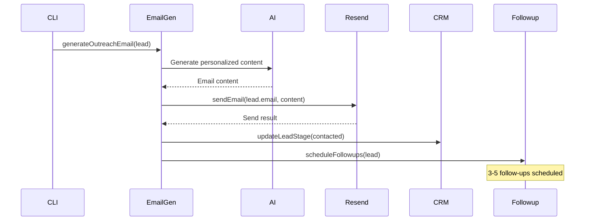
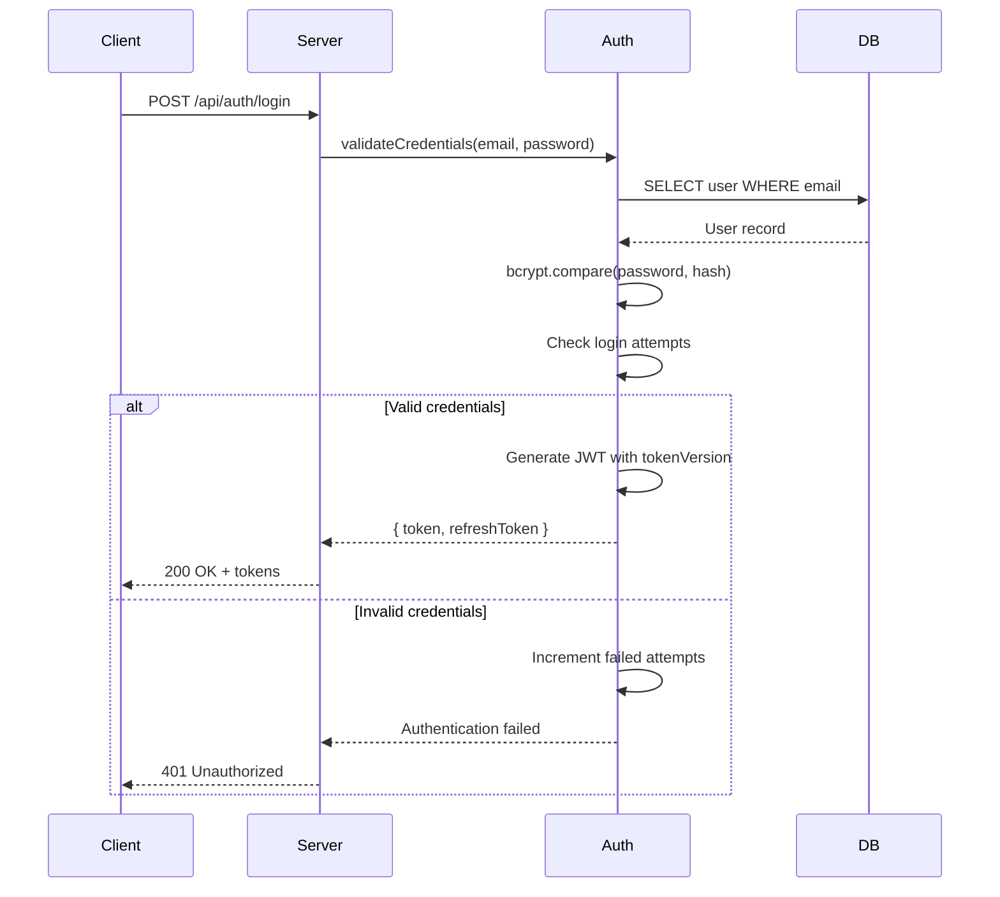

# AutoWebsites Pro - Codebase Map

> Auto-generated by Cartographer. Last mapped: 2026-01-23

## System Overview

AutoWebsites Pro is an automated lead generation and website proposal system. It discovers businesses needing websites, analyzes their online presence, generates AI-powered redesign proposals, and manages outreach campaigns.



## Directory Structure

```
autowebsites/
├── src/
│   ├── index.ts              # Application entry point
│   ├── cli.ts                # Interactive CLI interface
│   ├── ai/                   # AI integration (Anthropic Claude)
│   │   ├── anthropic.ts      # Claude API client
│   │   └── proposal-generator.ts # Website proposal generation
│   ├── capture/              # Website capture & analysis
│   │   ├── page-capture.ts   # Full page capture orchestration
│   │   ├── screenshots.ts    # Screenshot capture with Puppeteer
│   │   └── analyzer.ts       # Website quality analysis
│   ├── crm/                  # Lead management
│   │   ├── lead-model.ts     # Lead CRUD operations
│   │   ├── pipeline-manager.ts # Sales pipeline logic
│   │   └── activity-logger.ts # Lead activity tracking
│   ├── dashboard/            # Web dashboard
│   │   ├── server.ts         # Express server setup
│   │   ├── auth.ts           # JWT authentication
│   │   ├── routes/           # API route handlers
│   │   └── public/           # Static frontend assets
│   ├── db/                   # Database
│   │   └── migrations/       # SQL migration files
│   ├── discovery/            # Lead discovery
│   │   ├── google-places.ts  # Google Places API integration
│   │   ├── web-discovery.ts  # Web scraping for leads
│   │   ├── scraper.ts        # Generic web scraper
│   │   └── score-engine.ts   # Lead scoring algorithm
│   ├── email/                # Email outreach
│   │   ├── resend.ts         # Resend API client
│   │   ├── email-generator.ts # AI email content generation
│   │   ├── followup-scheduler.ts # Automated follow-ups
│   │   └── unsubscribe.ts    # Unsubscribe handling
│   ├── media/                # Media handling
│   │   └── image-optimizer.ts # Image optimization
│   ├── outreach/             # Outreach management
│   │   └── campaign-manager.ts # Campaign orchestration
│   ├── scheduler/            # Job scheduling
│   │   ├── queue.ts          # Job queue implementation
│   │   └── orchestrator.ts   # Workflow orchestration
│   ├── themes/               # Website design themes
│   │   ├── theme-*.ts        # Individual theme definitions
│   │   └── index.ts          # Theme registry
│   └── utils/                # Shared utilities
│       ├── config.ts         # Configuration management
│       ├── logger.ts         # Winston logging with PII redaction
│       ├── error-handler.ts  # Error handling utilities
│       ├── validation.ts     # Zod validation schemas
│       ├── rate-limiter.ts   # API rate limiting
│       ├── security-headers.ts # Security middleware
│       └── circuit-breaker.ts # External service resilience
├── package.json
├── tsconfig.json
└── CLAUDE.md
```

## Module Guide

### AI Module (`src/ai/`)

**Purpose**: Integrates with Anthropic's Claude API for AI-powered content generation.

| File | Purpose | Key Exports |
|------|---------|-------------|
| `anthropic.ts` | Claude API client wrapper | `AnthropicClient`, `generateText()`, `analyzeWebsite()` |
| `proposal-generator.ts` | Website redesign proposal generation | `ProposalGenerator`, `generateProposal()` |

**Dependencies**: `@anthropic-ai/sdk`, circuit-breaker utility
**Dependents**: capture module, email module, CLI

**Patterns**:
- Uses circuit breaker for API resilience
- Streaming responses for long content
- Token usage tracking

### Capture Module (`src/capture/`)

**Purpose**: Captures and analyzes existing websites for leads.

| File | Purpose | Key Exports |
|------|---------|-------------|
| `page-capture.ts` | Orchestrates full page capture | `captureWebsite()`, `CaptureResult` |
| `screenshots.ts` | Puppeteer screenshot capture | `takeScreenshot()`, `ScreenshotOptions` |
| `analyzer.ts` | Website quality analysis | `analyzeWebsite()`, `WebsiteAnalysis` |

**Dependencies**: Puppeteer, AI module
**Dependents**: CLI, orchestrator

**Gotchas**:
- Puppeteer requires Chrome/Chromium installed
- Screenshots stored in `tmp/captures/` directory
- Mobile and desktop captures taken separately

### CRM Module (`src/crm/`)

**Purpose**: Lead lifecycle management and sales pipeline.

| File | Purpose | Key Exports |
|------|---------|-------------|
| `lead-model.ts` | Lead CRUD operations | `LeadModel`, `Lead`, `LeadFilter` |
| `pipeline-manager.ts` | Pipeline stage transitions | `PipelineManager`, `moveToStage()`, `closeWon()` |
| `activity-logger.ts` | Activity timeline tracking | `ActivityLogger`, `logActivity()` |

**Dependencies**: Supabase client
**Dependents**: Dashboard routes, email module, CLI

**Patterns**:
- Soft deletes for lead history
- Pipeline stages: new → qualified → contacted → proposal_sent → negotiating → won/lost
- Activity logging for audit trail

### Dashboard Module (`src/dashboard/`)

**Purpose**: Web-based management dashboard with REST API.

| File | Purpose | Key Exports |
|------|---------|-------------|
| `server.ts` | Express server setup | `createServer()`, `startServer()` |
| `auth.ts` | JWT authentication | `authenticateToken()`, `hashPassword()` |
| `routes/leads.ts` | Lead management API | `createLeadsRouter()` |
| `routes/proposals.ts` | Proposal management API | `createProposalsRouter()` |
| `routes/analytics.ts` | Analytics API | `createAnalyticsRouter()` |
| `routes/campaigns.ts` | Campaign management API | `createCampaignsRouter()` |

**Dependencies**: Express, JWT, bcrypt, Zod, CRM module
**Dependents**: None (entry point)

**Security Features**:
- Rate limiting (5/10/100 req/min tiers)
- Helmet security headers
- JWT with token versioning
- Login attempt limiting
- Request correlation IDs

### Discovery Module (`src/discovery/`)

**Purpose**: Discovers potential leads from various sources.

| File | Purpose | Key Exports |
|------|---------|-------------|
| `google-places.ts` | Google Places API integration | `GooglePlacesClient`, `searchBusinesses()` |
| `web-discovery.ts` | Web-based lead discovery | `discoverLeads()` |
| `scraper.ts` | Generic web scraper | `Scraper`, `scrapeUrl()` |
| `score-engine.ts` | Lead quality scoring | `ScoreEngine`, `scoreLead()` |

**Dependencies**: Google Places API, Puppeteer
**Dependents**: CLI, orchestrator

**Scoring Criteria**:
- Website quality (0-10)
- Mobile responsiveness
- Load time
- SSL presence
- Content freshness

### Email Module (`src/email/`)

**Purpose**: Automated email outreach and follow-up campaigns.

| File | Purpose | Key Exports |
|------|---------|-------------|
| `resend.ts` | Resend API client | `ResendClient`, `sendEmail()` |
| `email-generator.ts` | AI-powered email content | `generateOutreachEmail()`, `generateFollowup()` |
| `followup-scheduler.ts` | Automated follow-up scheduling | `FollowupScheduler`, `scheduleFollowups()` |
| `unsubscribe.ts` | Unsubscribe handling | `handleUnsubscribe()`, `generateUnsubscribeLink()` |

**Dependencies**: Resend API, AI module, CRM module
**Dependents**: CLI, orchestrator, campaigns

**Patterns**:
- HTML email templates with escaping
- Unsubscribe link in all emails
- Follow-up sequences (3-5 emails)
- Email tracking via webhooks

### Scheduler Module (`src/scheduler/`)

**Purpose**: Background job processing and workflow orchestration.

| File | Purpose | Key Exports |
|------|---------|-------------|
| `queue.ts` | Job queue implementation | `JobQueue`, `addJob()`, `processNext()` |
| `orchestrator.ts` | Workflow orchestration | `Orchestrator`, `runPipeline()` |

**Dependencies**: Supabase (optional), file system
**Dependents**: CLI

**Job Types**: `discover`, `capture`, `generate`, `deploy`, `email`, `followup`, `score`

**Features**:
- Database-backed persistence (Supabase)
- Fallback to JSON file storage
- Atomic job claiming with `FOR UPDATE SKIP LOCKED`
- Retry with exponential backoff
- Rate limiting (30/min default)

### Themes Module (`src/themes/`)

**Purpose**: Pre-built website design themes for proposals.

| File | Purpose | Key Exports |
|------|---------|-------------|
| `index.ts` | Theme registry | `getTheme()`, `listThemes()` |
| `theme-modern.ts` | Modern minimal theme | `modernTheme` |
| `theme-classic.ts` | Classic business theme | `classicTheme` |
| `theme-bold.ts` | Bold creative theme | `boldTheme` |

**Dependencies**: None
**Dependents**: AI module, proposal generator

### Utils Module (`src/utils/`)

**Purpose**: Shared utilities and cross-cutting concerns.

| File | Purpose | Key Exports |
|------|---------|-------------|
| `config.ts` | Configuration with validation | `config`, `validateEnv()` |
| `logger.ts` | Winston logging with PII redaction | `logger`, `logError()`, `logSecurityEvent()` |
| `error-handler.ts` | Error handling utilities | `AppError`, `asyncHandler()`, `NotFoundError` |
| `validation.ts` | Zod validation schemas | `createLeadSchema`, `validatePassword()` |
| `rate-limiter.ts` | Express rate limiting | `rateLimiters`, `loginLimiter` |
| `security-headers.ts` | Security middleware | `securityHeaders()` |
| `circuit-breaker.ts` | External service resilience | `CircuitBreaker`, `circuitBreakers` |

**Patterns**:
- Zod for runtime validation
- Winston for structured logging
- Circuit breaker pattern for external APIs

## Data Flow

### Lead Discovery Flow



### Proposal Generation Flow



### Email Outreach Flow



### Authentication Flow



## Conventions

### Naming
- **Files**: kebab-case (`lead-model.ts`)
- **Classes**: PascalCase (`LeadModel`)
- **Functions**: camelCase (`getLeadById`)
- **Constants**: UPPER_SNAKE_CASE (`MAX_RETRIES`)
- **Interfaces**: PascalCase with `I` prefix optional (`Lead` or `ILead`)

### Code Style
- TypeScript strict mode enabled
- Async/await preferred over callbacks
- Zod for runtime validation
- Error classes extend `AppError`

### API Design
- RESTful routes (`GET /api/leads`, `POST /api/leads/:id/stage`)
- JSON responses with consistent structure
- Pagination: `{ data: [], pagination: { page, limit, total } }`
- Errors: `{ error: { code, message, details? } }`

### Logging
- Use structured logging with context
- Include correlation IDs for request tracing
- PII automatically redacted
- Security events logged separately

## Gotchas

1. **JWT Secret**: Must set `JWT_SECRET` in production - no fallback allowed
2. **CORS Origins**: Must set `CORS_ORIGINS` in production - no wildcard
3. **Puppeteer**: Requires Chrome/Chromium; may need `--no-sandbox` in Docker
4. **Rate Limiting**: In-memory storage resets on restart; use Redis for production clusters
5. **Login Attempts**: Stored in-memory; won't persist across restarts
6. **Job Queue**: Falls back to JSON file if Supabase unavailable
7. **Token Versioning**: Changing password invalidates all existing tokens
8. **Circuit Breaker**: Shared state; multiple instances need coordination

## Navigation Guide

**To add a new API endpoint:**
1. Create route handler in `src/dashboard/routes/<domain>.ts`
2. Add Zod validation schema
3. Use `asyncHandler()` wrapper
4. Register router in `src/dashboard/server.ts`

**To add a new job type:**
1. Add type to `JobType` union in `src/scheduler/queue.ts`
2. Register handler with `queue.registerHandler(type, handler)`
3. Add to orchestrator if part of pipeline

**To add a new theme:**
1. Create `src/themes/theme-<name>.ts`
2. Export theme configuration
3. Register in `src/themes/index.ts`

**To modify authentication:**
1. Update `src/dashboard/auth.ts` for logic
2. Update validation in `src/utils/validation.ts`
3. Update rate limits in `src/utils/rate-limiter.ts`

**To add external service integration:**
1. Create client in appropriate module
2. Add circuit breaker config in `src/utils/circuit-breaker.ts`
3. Add to config validation in `src/utils/config.ts`

---

If cartographer helped you, consider starring: https://github.com/kingbootoshi/cartographer - please!
