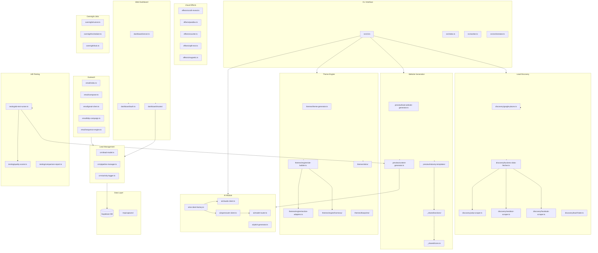
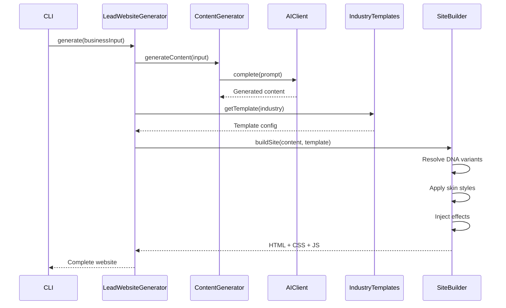
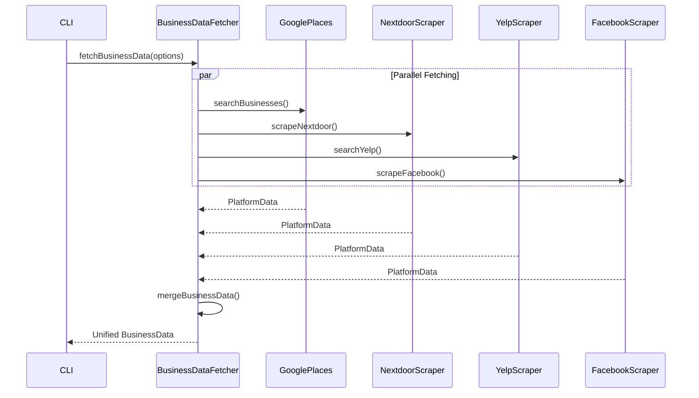
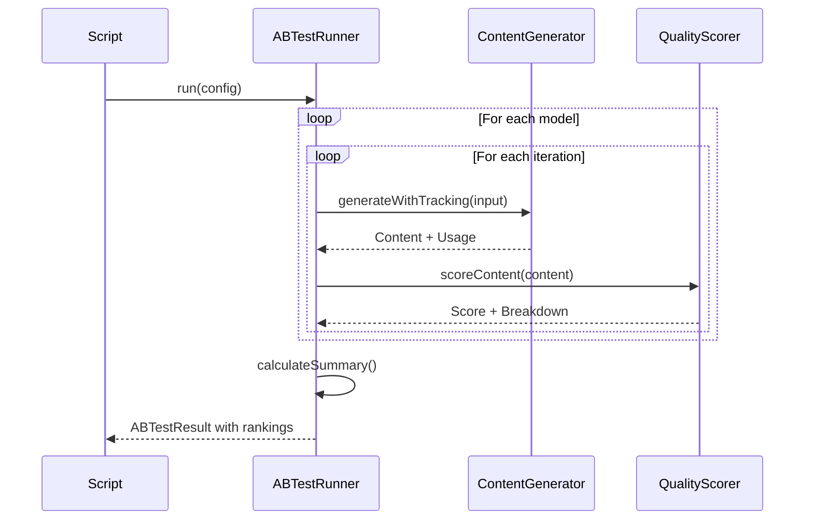

# AutoWebsites Pro - Codebase Map

> Auto-generated by Cartographer. Last mapped: 2026-02-08

## System Overview

AutoWebsites Pro is an automated lead generation and website proposal system. It discovers businesses needing websites, analyzes their online presence, generates AI-powered website previews with industry-specific templates, and manages outreach campaigns. The system supports multiple AI backends (Anthropic Claude, OpenRouter), advanced theming with DNA-based design variance, and multi-platform business data aggregation.



## Directory Structure

```
autowebsites/
├── src/
│   ├── index.ts              # Application entry point
│   ├── cli.ts                # Interactive CLI interface
│   ├── orchestrator.ts       # Main workflow orchestration
│   ├── worker.ts             # Background job worker
│   │
│   ├── ai/                   # AI Integration (Multi-backend)
│   │   ├── ai-client.ts      # Unified AI client interface
│   │   ├── ai-client-factory.ts # Factory for creating AI clients
│   │   ├── claude-client.ts  # Anthropic Claude API client
│   │   ├── openrouter-client.ts # OpenRouter multi-model client
│   │   ├── model-router.ts   # Model selection & routing
│   │   ├── pitch-generator.ts # Sales pitch generation
│   │   ├── website-analyzer.ts # Website analysis
│   │   └── objection-handler.ts # Sales objection handling
│   │
│   ├── capture/              # Website capture & analysis
│   │   ├── website-capture.ts # Full page capture orchestration
│   │   ├── dom-extractor.ts  # DOM content extraction
│   │   ├── style-analyzer.ts # CSS analysis
│   │   └── manifest-generator.ts # Capture manifest generation
│   │
│   ├── crm/                  # Lead management
│   │   ├── lead-model.ts     # Lead CRUD operations
│   │   ├── pipeline-manager.ts # Sales pipeline logic
│   │   ├── activity-logger.ts # Lead activity tracking
│   │   ├── proposal-generator.ts # Proposal generation
│   │   ├── contract-generator.ts # Contract generation
│   │   └── payment-handler.ts # Payment processing
│   │
│   ├── dashboard/            # Web dashboard
│   │   ├── server.ts         # Express server setup
│   │   ├── auth.ts           # JWT authentication
│   │   ├── routes/           # API route handlers
│   │   │   ├── leads.ts      # Lead management API
│   │   │   ├── proposals.ts  # Proposal API
│   │   │   ├── campaigns.ts  # Campaign API
│   │   │   ├── analytics.ts  # Analytics API
│   │   │   ├── jobs.ts       # Job queue API
│   │   │   └── overnight.ts  # Overnight jobs API
│   │   └── public/           # Static frontend assets
│   │
│   ├── db/                   # Database
│   │   └── migrations/       # SQL migration files
│   │
│   ├── discovery/            # Lead discovery (Multi-platform)
│   │   ├── index.ts          # Discovery module exports
│   │   ├── google-places.ts  # Google Places API
│   │   ├── yelp-scraper.ts   # Yelp scraping
│   │   ├── nextdoor-scraper.ts # Nextdoor scraping
│   │   ├── facebook-scraper.ts # Facebook page scraping
│   │   ├── yellowpages-scraper.ts # Yellow Pages scraping
│   │   ├── business-data.ts  # Business data types & merging
│   │   ├── business-data-fetcher.ts # Multi-platform data fetcher
│   │   ├── lead-finder.ts    # Lead discovery orchestration
│   │   ├── contact-extractor.ts # Contact info extraction
│   │   ├── contact-extractor-v2.ts # Enhanced contact extraction
│   │   └── spider-client.ts  # Web crawling client
│   │
│   ├── effects/              # Visual Effects Library
│   │   ├── scroll-reveal.ts  # IntersectionObserver animations
│   │   ├── parallax.ts       # Parallax scrolling effects
│   │   ├── counter.ts        # Animated number counters
│   │   ├── split-text.ts     # Text splitting animations
│   │   ├── magnetic.ts       # Magnetic hover effects
│   │   ├── interactions.ts   # Micro-interactions
│   │   ├── hero-video.ts     # Hero video backgrounds
│   │   └── texture-overlays.ts # Texture overlay effects
│   │
│   ├── email/                # Email outreach
│   │   ├── index.ts          # Email module exports
│   │   ├── composer.ts       # Email composition
│   │   ├── gmail-client.ts   # Gmail API client
│   │   ├── drip-campaign.ts  # Drip campaign management
│   │   ├── sequence-engine.ts # Email sequence orchestration
│   │   ├── analytics.ts      # Email analytics
│   │   └── sequences/        # Pre-built email sequences
│   │       ├── arizona-plumber.ts
│   │       └── no-website.ts
│   │
│   ├── media/                # Media handling
│   │   ├── media-generator.ts # Media generation
│   │   ├── video-generator.ts # Video generation
│   │   ├── before-after-generator.ts # Before/after comparisons
│   │   ├── theme-grid.ts     # Theme grid visualization
│   │   └── storage.ts        # Media storage
│   │
│   ├── overnight/            # Overnight job processing
│   │   ├── index.ts          # Module exports
│   │   ├── runner.ts         # Job execution
│   │   ├── scheduler.ts      # Job scheduling
│   │   ├── lock.ts           # Distributed locking
│   │   ├── config.ts         # Configuration
│   │   └── types.ts          # Type definitions
│   │
│   ├── outreach/             # Outreach management
│   │   ├── website-scorer.ts # Website quality scoring
│   │   └── lead-database.ts  # Lead database operations
│   │
│   ├── preflight/            # System preflight checks
│   │   ├── index.ts          # Preflight runner
│   │   ├── types.ts          # Check types
│   │   ├── reporter.ts       # Check reporting
│   │   └── checks/           # Individual checks
│   │       ├── ai.ts, database.ts, email.ts, etc.
│   │
│   ├── preview/              # Website preview generation
│   │   ├── server.ts         # Preview server
│   │   ├── deploy.ts         # Deployment logic
│   │   ├── lead-website-generator.ts # Main website generator
│   │   ├── content-generator.ts # AI content generation
│   │   └── industry-templates/ # Industry-specific templates
│   │       ├── index.ts      # Template registry
│   │       ├── _shared/      # Shared components
│   │       │   ├── icons.ts  # SVG icon library (30+ icons)
│   │       │   ├── types.ts  # Shared types
│   │       │   ├── utils.ts  # Shared utilities
│   │       │   ├── sections/ # Reusable sections
│   │       │   │   ├── hero-variants.ts  # 6+ hero layouts
│   │       │   │   ├── services-grid.ts  # Service cards
│   │       │   │   ├── about.ts          # About section
│   │       │   │   ├── testimonials.ts   # Testimonials
│   │       │   │   ├── contact-form.ts   # Contact forms
│   │       │   │   ├── footer.ts         # Footer
│   │       │   │   ├── dna-nav.ts        # Navigation
│   │       │   │   └── stats.ts          # Stats section
│   │       │   └── styles/   # Shared styles
│   │       │       ├── base-styles.ts
│   │       │       └── dna-styles.ts     # DNA design system
│   │       └── <industry>/   # Per-industry templates
│   │           └── template.ts
│   │
│   ├── scheduler/            # Job scheduling
│   │   ├── queue.ts          # Job queue implementation
│   │   ├── pipeline-runner.ts # Pipeline execution
│   │   └── retry-policy.ts   # Retry handling
│   │
│   ├── testing/              # A/B Testing Framework
│   │   ├── index.ts          # Module exports
│   │   ├── types.ts          # Test types
│   │   ├── ab-test-runner.ts # Test orchestration
│   │   ├── quality-scorer.ts # Content quality scoring
│   │   └── comparison-report.ts # Report generation
│   │
│   ├── themes/               # Theme Engine
│   │   ├── theme-generator.ts # Theme generation
│   │   ├── variance-planner.ts # Design variance planning
│   │   ├── template-loader.ts # Template loading
│   │   ├── gallery-generator.ts # Gallery generation
│   │   ├── blueprints/       # Industry blueprints
│   │   │   ├── index.ts
│   │   │   ├── professional-services.ts
│   │   │   ├── creative-visual.ts
│   │   │   ├── health-wellness.ts
│   │   │   └── service-business.ts
│   │   ├── skins/            # Visual skins
│   │   │   ├── index.ts
│   │   │   ├── agency.ts
│   │   │   ├── brutalist.ts
│   │   │   ├── glass.ts
│   │   │   ├── soft.ts
│   │   │   ├── swiss.ts
│   │   │   └── contract.ts
│   │   └── engine/           # Core theme engine
│   │       ├── index.ts
│   │       ├── site-builder.ts       # Website assembly
│   │       ├── section-adapters.ts   # Section rendering
│   │       ├── section-registry.ts   # Section registration
│   │       ├── layout-resolver.ts    # Layout resolution
│   │       ├── content-tone.ts       # Content tone adjustment
│   │       ├── verify-engine.ts      # Engine verification
│   │       └── harmony/              # Design harmony
│   │           ├── index.ts
│   │           ├── color-math.ts     # Color calculations
│   │           ├── grid-patterns.ts  # Grid systems
│   │           └── constraints.ts    # Design constraints
│   │
│   └── utils/                # Shared utilities
│       ├── config.ts         # Configuration management
│       ├── logger.ts         # Winston logging
│       ├── error-handler.ts  # Error handling
│       ├── validation.ts     # Zod validation schemas
│       ├── supabase.ts       # Supabase client
│       ├── health.ts         # Health checks
│       ├── csv-parser.ts     # CSV parsing
│       ├── rate-limiter.ts   # API rate limiting
│       ├── security-headers.ts # Security middleware
│       └── circuit-breaker.ts # External service resilience
│
├── scripts/                  # Utility scripts
│   ├── regenerate-gustavo.ts # Sample regeneration
│   ├── run-model-ab-test.ts  # A/B test runner
│   └── test-openrouter.ts    # OpenRouter testing
│
├── samples/                  # Generated samples
│   ├── dentist-friendly.html
│   ├── electrician-trustworthy.html
│   ├── gym-maverick.html
│   ├── lawyer-executive.html
│   ├── photographer-minimal.html
│   ├── plumber-bold.html
│   ├── realtor-elegant.html
│   └── restaurant-creative.html
│
├── package.json
├── tsconfig.json
└── CLAUDE.md
```

## Module Guide

### AI Module (`src/ai/`)

**Purpose**: Multi-backend AI integration supporting Anthropic Claude and OpenRouter with 30+ models.

| File | Purpose | Key Exports |
|------|---------|-------------|
| `ai-client.ts` | Unified AI client interface | `AIClient`, `CompletionOptions`, `CompletionResult` |
| `ai-client-factory.ts` | Factory for creating AI clients | `createAIClient()`, `getDefaultAIClient()`, `getOpenRouterAIClient()` |
| `claude-client.ts` | Anthropic Claude API client | `ClaudeClient`, `getClaudeClient()` |
| `openrouter-client.ts` | OpenRouter multi-model client | `OpenRouterClient`, `getOpenRouterClient()` |
| `model-router.ts` | Model selection and routing | `ModelId`, `getModelConfig()`, `routeToModel()` |
| `pitch-generator.ts` | Sales pitch generation | `generatePitch()` |
| `website-analyzer.ts` | Website analysis with AI | `analyzeWebsite()` |

**Supported Models (via OpenRouter)**:
- Claude 3.5 Sonnet, Claude 3 Haiku
- GPT-4o, GPT-4o-mini
- Gemini 2.0 Flash, Gemini 1.5 Pro
- DeepSeek R1, Mistral Large
- Llama 3.3 70B

**Patterns**:
- Adapter pattern for backend abstraction
- Token usage tracking across all backends
- Automatic cost estimation

### Discovery Module (`src/discovery/`)

**Purpose**: Multi-platform business discovery from Google, Yelp, Nextdoor, Facebook, and Yellow Pages.

| File | Purpose | Key Exports |
|------|---------|-------------|
| `business-data-fetcher.ts` | Orchestrates multi-platform fetching | `fetchBusinessData()`, `fetchFromNextdoorOnly()` |
| `business-data.ts` | Business data types & merging | `BusinessData`, `mergeBusinessData()` |
| `google-places.ts` | Google Places API | `searchBusinesses()`, `getPlaceDetailsWithReviews()` |
| `yelp-scraper.ts` | Yelp scraping with Playwright | `YelpScraper`, `searchYelp()` |
| `nextdoor-scraper.ts` | Nextdoor page scraping | `scrapeNextdoor()` |
| `facebook-scraper.ts` | Facebook page scraping | `scrapeFacebook()` |
| `lead-finder.ts` | Lead discovery orchestration | `findLeads()` |
| `contact-extractor-v2.ts` | Enhanced contact extraction | `extractContacts()` |

**Data Merging Priority**:
1. Explicitly provided URLs (Nextdoor/Yelp/Facebook)
2. Google Places (most structured)
3. Scraped platforms (for supplementary data)

**Features**:
- Parallel fetching from all platforms
- Intelligent data merging with conflict resolution
- Logo URL extraction
- Review aggregation across platforms

### Preview Module (`src/preview/`)

**Purpose**: Generates production-quality website previews with industry-specific templates.

| File | Purpose | Key Exports |
|------|---------|-------------|
| `lead-website-generator.ts` | Main website generation | `LeadWebsiteGenerator`, `generateWebsite()` |
| `content-generator.ts` | AI-powered content generation | `ContentGenerator`, `generateContent()` |
| `server.ts` | Preview server | `startPreviewServer()` |
| `deploy.ts` | Deployment to Vercel/hosting | `deployPreview()` |

**Industry Templates** (14 industries):
- Accountant, Chiropractor, Contractor, Dentist
- Electrician, Financial Advisor, Gym, Lawyer
- Photographer, Plumber, Realtor, Restaurant
- Roofer, Therapist, Veterinarian

**Shared Components** (`_shared/`):

| Component | Purpose |
|-----------|---------|
| `icons.ts` | 30+ SVG icons with `getServiceIcon()` auto-matching |
| `sections/hero-variants.ts` | 6+ hero layouts (centered, split, background, etc.) |
| `sections/services-grid.ts` | Service cards with hover effects |
| `sections/contact-form.ts` | Contact forms with icons |
| `sections/footer.ts` | Footers with social links |
| `styles/dna-styles.ts` | DNA design system variables |

### Themes Module (`src/themes/`)

**Purpose**: Advanced theming engine with DNA-based design variance and multiple visual skins.

| File | Purpose | Key Exports |
|------|---------|-------------|
| `theme-generator.ts` | Theme generation orchestration | `generateTheme()` |
| `variance-planner.ts` | Design variance planning | `planVariance()` |
| `engine/site-builder.ts` | Website assembly from sections | `SiteBuilder`, `buildSite()` |
| `engine/section-adapters.ts` | Section rendering adapters | `adaptSection()` |
| `engine/harmony/` | Design harmony algorithms | Color math, grid patterns, constraints |

**Skins**:
- `agency` - Bold, impactful agency aesthetic
- `brutalist` - Raw, architectural look
- `glass` - Glassmorphism effects
- `soft` - Gentle, approachable feel
- `swiss` - Clean Swiss/International style
- `contract` - Document-like professional

**Blueprints** (industry-specific defaults):
- Professional Services
- Creative/Visual
- Health & Wellness
- Service Business

**DNA System**:
- `H1-H12`: Hero variants
- `L1-L12`: Layout variants
- `D1-D12`: Detail density levels
- `T1-T12`: Typography scales

### Effects Module (`src/effects/`)

**Purpose**: Production-quality visual effects and animations for generated websites.

| File | Purpose | Key Exports |
|------|---------|-------------|
| `scroll-reveal.ts` | IntersectionObserver animations | `generateScrollRevealCSS()`, `generateScrollRevealScript()`, `generateUnifiedRevealScript()` |
| `parallax.ts` | Parallax scrolling effects | `generateParallaxCSS()`, `generateParallaxScript()` |
| `counter.ts` | Animated number counters | `generateCounterScript()` |
| `split-text.ts` | Text splitting animations | `generateSplitTextCSS()` |
| `magnetic.ts` | Magnetic hover effects | `generateMagneticScript()` |
| `interactions.ts` | Micro-interactions | `generateInteractionStyles()` |

**Unified Reveal System**:
- Single IntersectionObserver handles all reveal animations
- Supports: `data-reveal="up|scale|fade|split"`
- Supports: `data-counter` for animated counters
- Respects `prefers-reduced-motion`

### Testing Module (`src/testing/`)

**Purpose**: A/B testing framework for comparing AI model outputs.

| File | Purpose | Key Exports |
|------|---------|-------------|
| `ab-test-runner.ts` | Test orchestration | `ABTestRunner`, `run()` |
| `quality-scorer.ts` | Content quality scoring | `scoreContent()`, `createScoringConfig()` |
| `comparison-report.ts` | Report generation | `generateComparisonReport()` |
| `types.ts` | Test type definitions | `ABTestConfig`, `ABTestResult`, `ModelRunResult` |

**Quality Scoring Criteria**:
- Headline: word count, location mention, industry keywords, compelling language
- Services: count, description length, relevance
- About: word count, paragraph structure, professional tone
- Overall weighted score

**Output**:
- Rankings by quality, cost, speed
- Best overall (quality/cost ratio)
- Detailed breakdowns per model

### Overnight Module (`src/overnight/`)

**Purpose**: Scheduled overnight job processing for batch operations.

| File | Purpose | Key Exports |
|------|---------|-------------|
| `runner.ts` | Job execution | `runOvernightJob()` |
| `scheduler.ts` | Job scheduling | `scheduleOvernightRun()` |
| `lock.ts` | Distributed locking | `acquireLock()`, `releaseLock()` |
| `config.ts` | Configuration | `getOvernightConfig()` |
| `types.ts` | Type definitions | `OvernightJob`, `PreviewContent` |

### Email Module (`src/email/`)

**Purpose**: Email outreach with drip campaigns and sequence automation.

| File | Purpose | Key Exports |
|------|---------|-------------|
| `composer.ts` | Email composition | `composeEmail()` |
| `gmail-client.ts` | Gmail API client | `GmailClient`, `sendEmail()` |
| `drip-campaign.ts` | Drip campaign management | `DripCampaign`, `startCampaign()` |
| `sequence-engine.ts` | Email sequence orchestration | `SequenceEngine`, `processSequence()` |
| `analytics.ts` | Email analytics | `trackOpen()`, `trackClick()` |

**Pre-built Sequences**:
- Arizona Plumber (localized outreach)
- No Website (businesses without web presence)

### CRM Module (`src/crm/`)

**Purpose**: Lead lifecycle management and sales pipeline.

| File | Purpose | Key Exports |
|------|---------|-------------|
| `lead-model.ts` | Lead CRUD operations | `LeadModel`, `Lead`, `LeadFilter` |
| `pipeline-manager.ts` | Pipeline stage transitions | `PipelineManager`, `moveToStage()` |
| `activity-logger.ts` | Activity timeline tracking | `ActivityLogger`, `logActivity()` |
| `proposal-generator.ts` | Proposal PDF generation | `generateProposal()` |
| `contract-generator.ts` | Contract generation | `generateContract()` |
| `payment-handler.ts` | Payment processing | `processPayment()` |

**Pipeline Stages**: new → qualified → contacted → proposal_sent → negotiating → won/lost

### Dashboard Module (`src/dashboard/`)

**Purpose**: Web-based management dashboard with REST API.

| File | Purpose | Key Exports |
|------|---------|-------------|
| `server.ts` | Express server setup | `createServer()`, `startServer()` |
| `auth.ts` | JWT authentication | `authenticateToken()`, `hashPassword()` |
| `routes/*.ts` | API route handlers | Various routers |

**API Routes**:
- `/api/leads` - Lead management
- `/api/proposals` - Proposal management
- `/api/campaigns` - Campaign management
- `/api/analytics` - Analytics data
- `/api/jobs` - Job queue management
- `/api/overnight` - Overnight job control

### Utils Module (`src/utils/`)

**Purpose**: Shared utilities and cross-cutting concerns.

| File | Purpose | Key Exports |
|------|---------|-------------|
| `config.ts` | Configuration with validation | `config`, `validateEnv()` |
| `logger.ts` | Winston logging with PII redaction | `logger`, `logError()` |
| `error-handler.ts` | Error handling utilities | `AppError`, `asyncHandler()` |
| `validation.ts` | Zod validation schemas | `createLeadSchema`, `validatePassword()` |
| `supabase.ts` | Supabase client | `supabase` |
| `circuit-breaker.ts` | External service resilience | `CircuitBreaker` |

## Data Flow

### Website Generation Flow



### Multi-Platform Discovery Flow



### A/B Testing Flow



## Conventions

### Naming
- **Files**: kebab-case (`lead-model.ts`)
- **Classes**: PascalCase (`LeadModel`)
- **Functions**: camelCase (`getLeadById`)
- **Constants**: UPPER_SNAKE_CASE (`MAX_RETRIES`)
- **Interfaces**: PascalCase (`Lead`, `BusinessData`)

### Code Style
- TypeScript strict mode enabled
- Async/await preferred over callbacks
- Zod for runtime validation
- Error classes extend `AppError`

### DNA Design System
- Variables prefixed with `--` in CSS
- Typography scale: `--text-display` through `--text-xs`
- Spacing scale: `--space-xs` through `--space-3xl`
- Color system: `--primary`, `--accent`, `--bg-*`, `--text-*`

### Icon Usage
```typescript
import { icons, getServiceIcon } from './_shared/icons';

// Direct usage
icons.phone({ size: 20, className: 'icon' })

// Auto-match by service name
getServiceIcon('Plumbing Repair') // Returns wrench icon
getServiceIcon('Emergency Service') // Returns emergency icon
```

## Gotchas

1. **AI Backend Selection**: Set `OPENROUTER_API_KEY` for OpenRouter, otherwise falls back to Anthropic
2. **Business Data Merging**: Explicitly provided URLs take priority over auto-discovered data
3. **DNA Variants**: Must be valid (H1-H12, L1-L12, etc.) or defaults are used
4. **Overnight Lock**: Uses Supabase for distributed locking - only one instance runs at a time
5. **Icon Auto-matching**: `getServiceIcon()` uses keyword matching - may need manual override for edge cases
6. **Quality Scorer**: Scores are relative - useful for comparison, not absolute quality measurement
7. **Preflight Checks**: Run `preflight` before deploying to verify all services are configured

## Navigation Guide

**To add a new AI model:**
1. Add model config to `src/ai/model-router.ts`
2. Model will be available via OpenRouter automatically

**To add a new industry template:**
1. Create `src/preview/industry-templates/<industry>/template.ts`
2. Export template configuration
3. Register in `src/preview/industry-templates/index.ts`

**To add a new visual effect:**
1. Create `src/effects/<effect>.ts`
2. Export CSS and Script generators
3. Integrate in `site-builder.ts` or section files

**To add a new discovery platform:**
1. Create `src/discovery/<platform>-scraper.ts`
2. Return `PlatformBusinessData` format
3. Add to `business-data-fetcher.ts` parallel fetching

**To add a new skin:**
1. Create `src/themes/skins/<skin>.ts`
2. Export skin configuration
3. Register in `src/themes/skins/index.ts`

**To run A/B tests:**
```bash
node --env-file=.env scripts/run-model-ab-test.ts
```

---

If cartographer helped you, consider starring: https://github.com/kingbootoshi/cartographer
